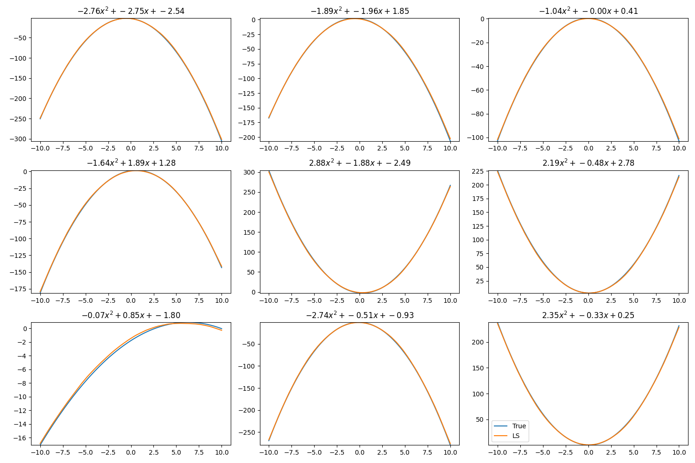
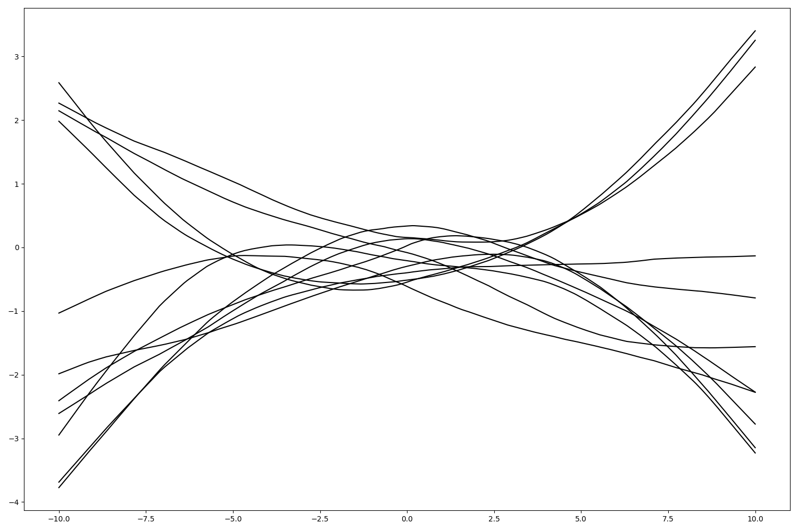
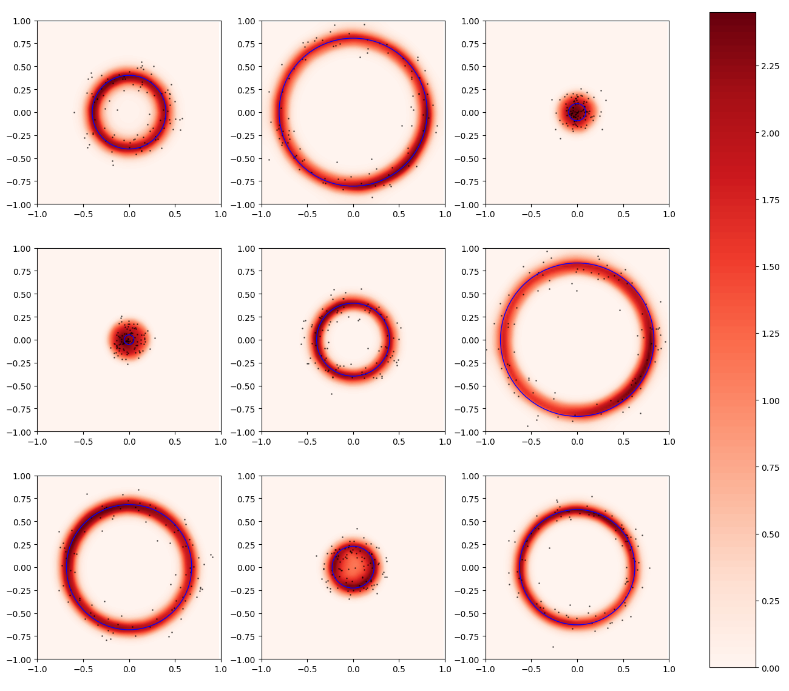

# Function Encoder

A function encoder learns basis functions/vectors over arbitrary Hilbert spaces. This allows for zero-shot transfer within this learned by space by using a weighted combination of the basis functions to approximate any function in the space. The coefficients can be calculated quickly from a small amount of data, either using an inner product or the least squares method. The basis functions are learned from data as a neural network, which allows them to scale to high-dimensional function spaces. Furthermore, since the number of basis functions is fixed, this yields a fixed-size representation of the function which can be used for downstream tasks. 

See [this paper](https://arxiv.org/abs/2501.18373) for an explanation of function encoders. 

## Installation
For the latest stable release:
```commandline
pip install FunctionEncoder
```
For the latest version:
```commandline
pip install git+https://github.com/tyler-ingebrand/FunctionEncoder.git
```


## Examples

Each of the following examples can be found in the Examples/ directory. These examples illustrate the basis use of this repo and algorithm, but are by no means the extent of its applications or scalability. 

### Euclidean Vectors

This algorithm can be applied to any Hilbert space. To visualize what this algorithm looks like, we can apply it to Euclidean vectors. Watch as the basis vectors (black) converge to the Hilbert space being fit (blue square).

https://github.com/tyler-ingebrand/FunctionEncoder/assets/105821676/174ddf15-de2d-44dc-b7fe-6b5fad831a4b

### Quadratics



In the figure above, each panel shows a quadratic function (blue) and its function encoder approximation (orange). Small amounts of data are taken from each quadratic function, and used to compute a representation by taking the Monte Carlo approximation of the inner product between the function and basis functions. Then, the function is approximated as a weighted combination of basis functions. As you can see, a single set of learned basis functions is able to reproduce all nine of these quadratics accurately. 

The basis functions look like this:



### Distributions

As distributions are also Hilbert spaces, we can apply the exact same algorithm. The only difference is the definition of the inner product. The black dots below are example data points, and the red area indicates the approximated probability density function. Just like in the quadratic example, the same basis functions are able to approximate the pdfs of all of these distributions. 



## Related Papers

* ["Zero-Shot Reinforcement Learning Via Function Encoders" (ICML 2024)](https://arxiv.org/abs/2401.17173)
* ["Zero-Shot Transfer of Neural ODEs" (NeurIPS 2024)](https://arxiv.org/abs/2405.08954)
* ["Basis-to-Basis Operator Learning Using Function Encoders" (CMAME)](https://arxiv.org/abs/2410.00171)


## Citation

If you use this repo for research, please cite 

```
@article{ingebrand_2025_fe_transfer,
  author       = {Tyler Ingebrand and
                  Adam J. Thorpe and
                  Ufuk Topcu},
  title        = {Function Encoders: A Principled Approach to Transfer Learning in Hilbert Spaces},
  year         = {2025}
}
```
For the full experiments corresponding to this paper, see [here](https://github.com/tyler-ingebrand/FEtransfer).
